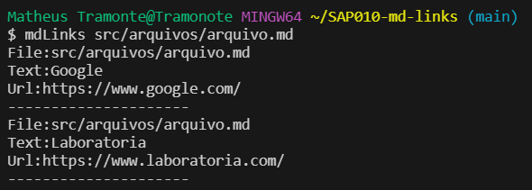
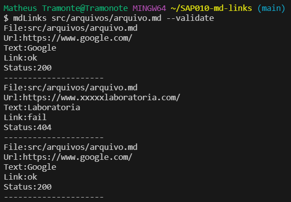
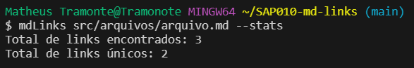
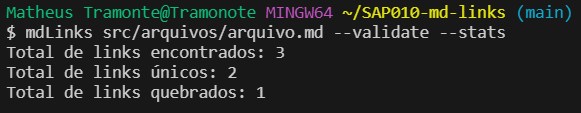
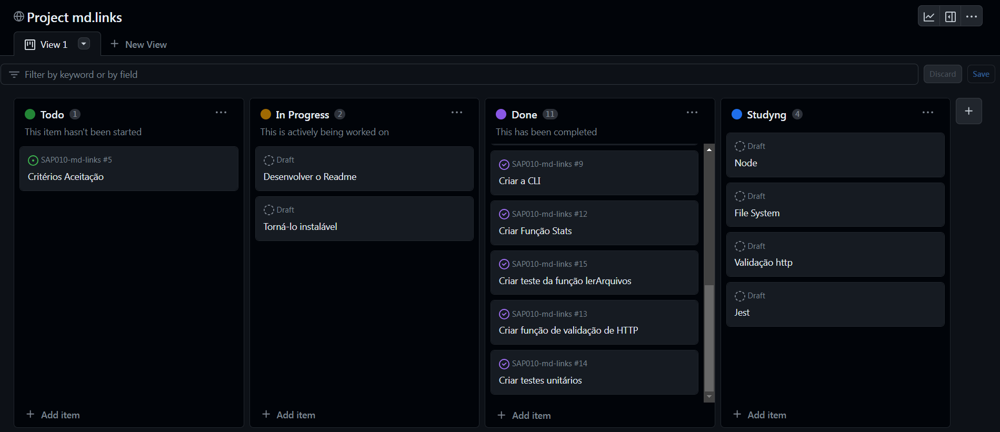
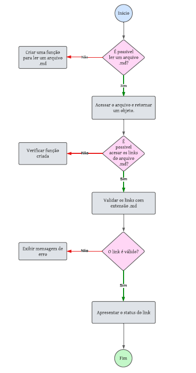

# Markdown Links

## Índice

* [1. Introdução](#1-introdução)
* [2. Guia de Instalação](#2-guia-de-instalação-📈)
* [3. Guia de Uso](#3-guia-de-uso-💬)
* [4. Gerenciamento de Projetos](#4-gerenciamento-de-projetos-✒️)
* [5. Ferramentas utilizadas](#5-ferramentas-utilizadas-🛠️)
* [6. Desenvolvedora](#6-desenvolvedora👩‍💻)

## 1. Introdução

Markdown é uma linguagem de marcação muito popular entre os programadores. É usada em muitas plataformas que manipulam texto (GitHub, fórum, blogs e etc) e é muito comum encontrar arquivos com este formato em qualquer repositório (começando pelo tradicional README.md).

Os arquivos Markdown normalmente contém links que podem estar quebrados, ou que já não são válidos, prejudicando muito o valor da informação que está ali.

Uma comunidade open source nos propôs criar uma ferramenta, usando Node.js, que leia e analise arquivos no formato Markdown, para verificar os arquivos que contenham links e mostrar algumas estatísticas.

## 2. Guia de Instalação 📈
Para instalar esta biblioteca você deve executar a seguinte linha de comando:
  `npm i fernandacanicais-mdlinks`. 
 
  Observação:
  É necessário ter a instalação do Node.
  Após a instalação da biblioteca, certifique de ter um arquivo com a extensão (.md) com links dentro.

## 3. Guia de Uso 💬
No seu terminal rode o comando mdLinks + o caminho do arquivo e irá receber o caminho, texto e a url do arquivo selecionado.

`mdLinks<caminho-do-arquivo>👇`

Além das informações acima, você poderá fazer uma requisição HTTP utilizando a propriedade `--validate` e receber o status e ok dos seus links.

`mdLinks<caminho-do-arquivo> --validate`👇

Você poderá fazer a verificação das estatísticas dos links desse arquivo, utilizando a propriedade `--stats`, e receber o total de links encontrados no seu arquivo e quantos desses são únicos.

`mdLinks<caminho-do-arquivo> --stats`👇

Você também pode combinar as propriedades e verificar a validação dos links e estatísticas do seu arquivo utilizando `--validate --stats`, e receber o total de links encontrados, quantos desses são únicos e quantos estão quebrados.

`mdLinks<caminho-do-arquivo> --validate --stats`👇

## 4. Gerenciamento de projeto ✒️

Neste projeto, utilizei a ferramenta Git Projects para organização e mapear as tarefas, adotando a metodologia de sprints e priorização de backlog. E tambem utilizado o metodo de desenvolver um fluxograma para entender o objetivo do projeto backend.

### Git Project:

### Fluxograma:

## 5. Ferramentas utilizadas 🛠️
 

## 6. Desenvolvedora👩‍💻 

Fernanda Caniçais

